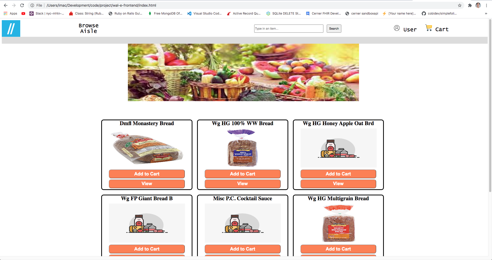
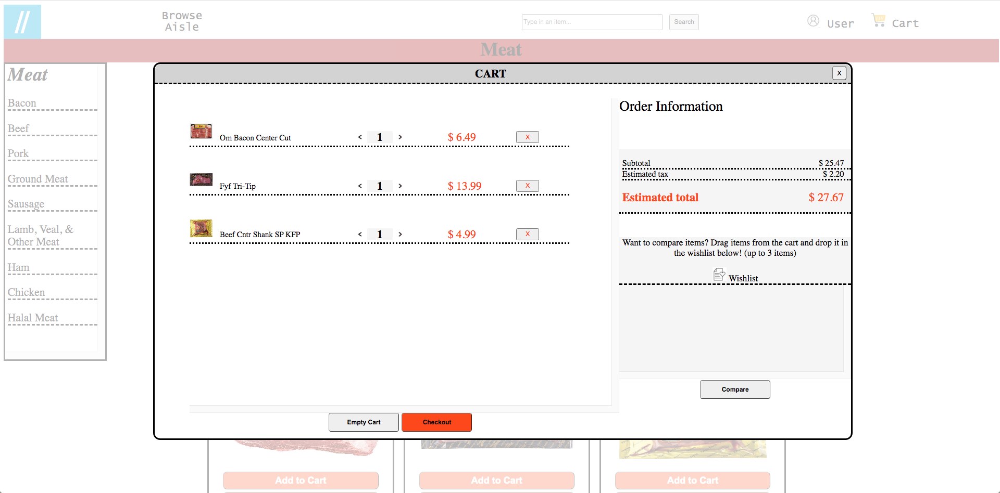
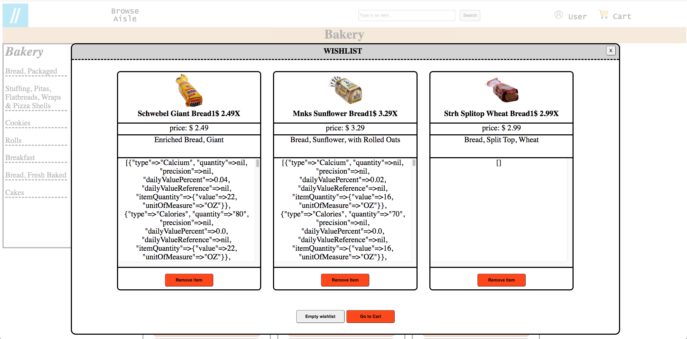
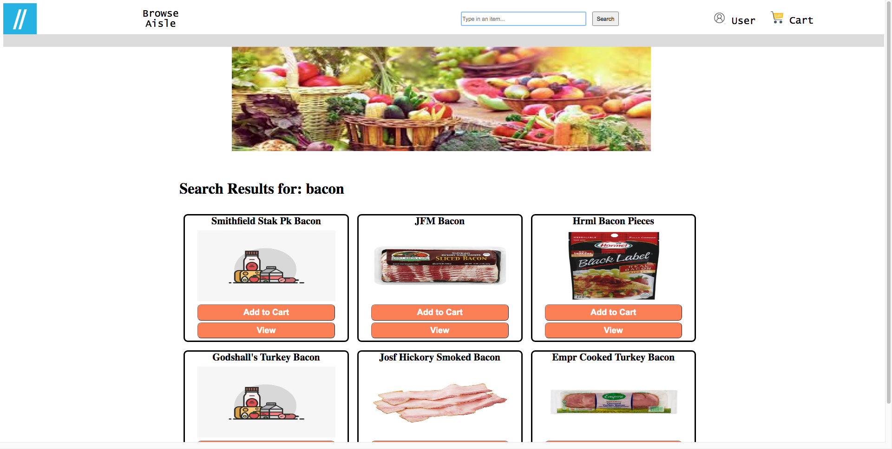

# WALL-E 
You can shop and compare the items with WALL-E
- Search for any items you want to shop.
- OR, go through the categories and add the item to the cart.

## This project includes...
Wegman API
- Used Postman to search the API
- Retrieve items: name, price, description, nutrition, category, and sub-category.

## User should be able to...
- Go through categories and to the sub-categories for an item.
- View the item, and add the item to the cart.
- Use the search bar to search for an item.
- Drag and drop the up to three items in the cart to the wishlist, where the user can compare the nutrition, descriptions, and prices for each item.

## To run this CLI...
- Go to our backend repo, and clone it, and follow the README to run the program.
```https://github.com/abeciana1/wal-e-backend```
- Once the backend is running, you can clone this frontend repo, and copy and paste the index.html path.

## Versions...
### Backend
- Ruby 2.7.1p33
- Rails 6.0.3.2
- Yarn 1.22.4
- postgres (PostgreSQL) 12.3

## Into the app 🚀
#### Once the backend is seeded and the page has been loaded, you can start shopping! 





#### You can view the available categories if you hover the mouse to the Browse Aisle in the headers. 
#### Go in, search through the sub-categories to view the appropriate items. Click "View" to see more description of the item, and click "Add to Cart" if you wish to put it in the cart for checkout or compare items. 





#### You should be able to see the items that you have added. You can increase/decrease the quantity of item and the subtotal reflects on the right amount. If you wish to compare 2 or 3 items, drag the items and drop them to the Wishlist and click "Compare".





#### You can compare the items by their description, price, and nutrition. The nutrition box needs more work, as we ran out of the time. This is one of few stretch goals that we can work on.



#### If you want to search for an item, go to the search form and type in the item you wish to search and hit enter.

## Developers
### Se Min Lee
- email: seminlee2794@gmail.com
- github: https://github.com/Seminlee94
- linkedIn: https://www.linkedin.com/in/se-min-lee-149188105/
- Medium: https://medium.com/@mlsml94
- portfolio: https://seminlee94.github.io/semin/

### Alex Beciana

# Demo
https://www.youtube.com/watch?v=58Dlbg41p70

## Please check out Se Min Lee's previous demos and projects.
#### Demo
- https://www.youtube.com/watch?v=sn4SqkDkPZQ&t=62s << Flatiron Consulting
- https://www.youtube.com/watch?v=TVFmlVFrffw&t=5s << Shop N Cook
- Mod4 Project Cart-In coming soon!

#### Github Codes
- https://github.com/cdemarti/mod2_final_project << code for Flatiron Consulting
- https://github.com/jakelozano94/ruby-project-guidelines-nyc01-seng-ft-071320  << code for Shop N Cook
- https://github.com/Seminlee94/mod4project-react << code for Cart-In(front end)
- https://github.com/Seminlee94/mod4project-backend << code for Cart-In(back end)
